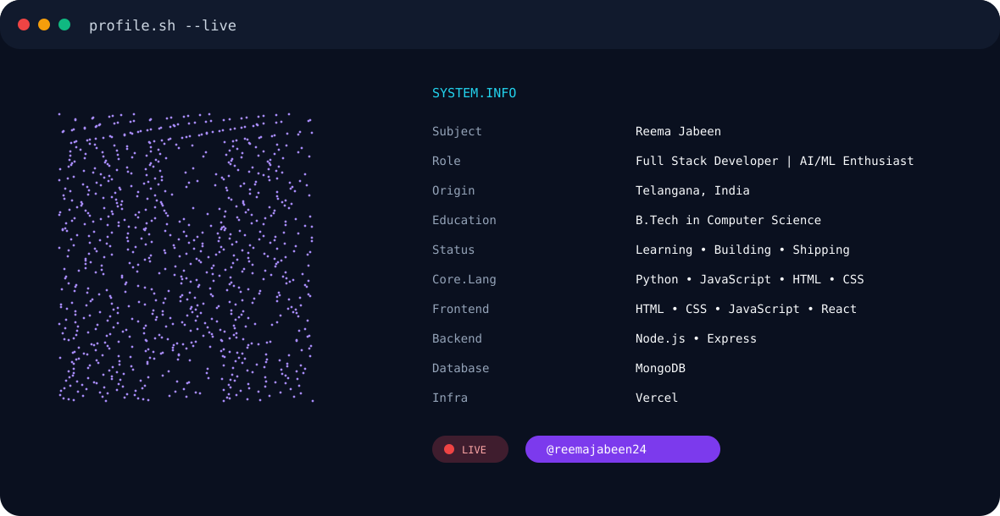
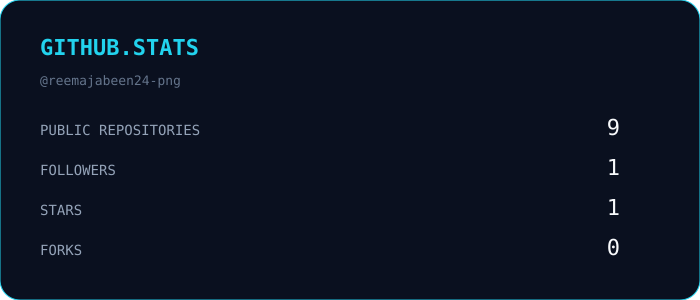

<picture>
  <source
    media="(prefers-color-scheme: dark)"
    srcset="./assets/dark.svg"
  />

  <source
    media="(prefers-color-scheme: light)"
    srcset="./assets/light.svg"
  />

  
</picture>
 

## 🐍 Contribution Activity

  

